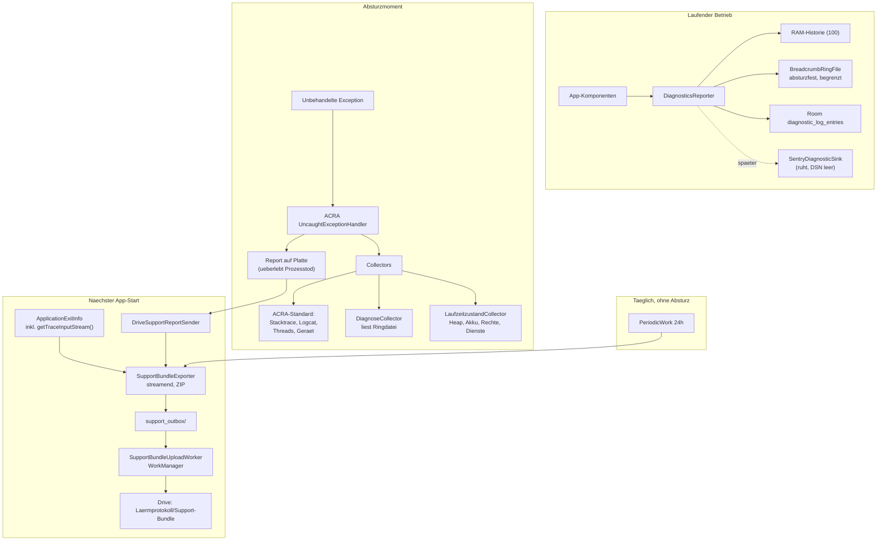

# Konzept: Absturzsichere Diagnose mit automatischem Drive-Upload (M12)

**Stand:** 17.09.2026
**Status:** Konzept, vom Owner noch nicht abgenommen
**Anlass:** Owner-Meldung 17.09.2026 — „Die App crasht während des Aufzeichnungsbetriebs, gerade
beim Durchsehen der Diagnoselogs."
**Vorgängerdokument:** [DIAGNOSE_OBSERVABILITY_KONZEPT.md](DIAGNOSE_OBSERVABILITY_KONZEPT.md)
(dieses Dokument korrigiert dessen Statusangaben, siehe Abschnitt 1.3)
**Umsetzungsprompts:** [PROMPT_M12_CRASH_DIAGNOSE.md](PROMPT_M12_CRASH_DIAGNOSE.md)

---

## 1. Bestandsaufnahme — warum der aktuelle Absturz nicht analysierbar ist

### 1.1 Was tatsächlich funktioniert

Die Diagnoseschicht unter `com.example.lrmprotokoll.diagnose.*` ist ordentlich gebaut und wird
breit benutzt. Belegt funktionsfähig sind:

| Baustein | Beleg |
|---|---|
| `CompositeDiagnosticsReporter` | Redaction, Fingerprint, Rate-Limiting, Sink-Verteilung — mit Tests |
| `DiagnosticRedactor` | Entfernt Tokens, MAC-Adressen, Passwörter — mit Tests |
| `SupportBundleExporter` | Baut ein ZIP mit `summary.json`, `events.jsonl`, `breadcrumbs.jsonl`, `device.json`, `checksums.sha256` |
| `DriveSyncCoordinator` / `GoogleDriveApiClient` | Vollständiger, erprobter Drive-Upload inklusive OAuth, Ordnerbaum, resumable Upload |
| `DiagnosticLogCleanupCoordinator` | 7-Tage-Bereinigung des lokalen Logs |

Die Infrastruktur, auf der M12 aufsetzt, ist also vorhanden. Es fehlt nicht das Fundament,
sondern genau der Pfad vom Absturz zur Datei.

### 1.2 Die sieben Lücken

Jede einzelne davon ist im Code nachgewiesen, nicht vermutet:

**L1 — Es gibt keinen `UncaughtExceptionHandler.`**
Eine Suche über `app/src/main` findet kein `Thread.setDefaultUncaughtExceptionHandler`.
`DiagnosticCode.APP_UNCAUGHT` wird ausschließlich vom `CoroutineExceptionHandler` des
ConnectionSupervisor-Scopes verwendet (`AppContainer.kt:74`). **Bei einem echten unbehandelten
Absturz existiert der Stacktrace nirgendwo** — er geht mit dem Prozess verloren.

**L2 — Der Remote-Pfad ist abgeschaltet.**
`app/build.gradle.kts:39` setzt `SENTRY_DSN = ""`. `LaermprotokollApp.initSentry()` steigt bei
leerem DSN sofort aus, `SentryDiagnosticSink` prüft zusätzlich `Sentry.isEnabled()`. Der komplette
Sentry-Zweig ist damit toter Code. Das Vorgängerkonzept führt ihn als „✅ Implementiert
(DSN konfigurierbar)" — formal richtig, praktisch wirkungslos.

**L3 — Breadcrumbs überleben den Absturz nicht.**
`CompositeDiagnosticsReporter` hält sie in einer `CopyOnWriteArrayList` mit `maxHistorySize = 100`
— reiner Arbeitsspeicher. Beim Prozesstod sind sie weg. Genau der Kontext der letzten Sekunden
vor dem Absturz, also das Wertvollste überhaupt, ist nicht rekonstruierbar.

**L4 — Das lokale Log ist im Auslieferungszustand leer.**
`LocalDiagnosticSink` und `DiagnosticLogger` schreiben nur, wenn
`settingsManager.diagnoseLoggingAktiv` gesetzt ist. Laut KDoc von `DiagnosticLogEntity` ist das
„standardmäßig aus". Wer den Schalter nie gefunden hat, hat nach einem Absturz gar nichts.

**L5 — Das Betriebssystem liefert Daten, die wir wegwerfen.**
`LaermprotokollApp.checkPreviousProcessExit()` (`LaermprotokollApp.kt:66`) holt mit
`getHistoricalProcessExitReasons(packageName, 0, 1)` nur **einen** Eintrag, obwohl Android bis zu
16 vorhält. Vor allem aber wird `ApplicationExitInfo.getTraceInputStream()` nie gelesen — dort
liegt bei `REASON_ANR` der vollständige Thread-Dump und ab API 31 bei `REASON_CRASH_NATIVE` das
Tombstone-Protobuf. Diese Daten sind gratis und werden verworfen.

**L6 — Kein automatischer Rückkanal.**
Das Support-Bundle verlässt das Gerät nur über einen manuellen Share-Intent im DiagnoseScreen.
`DriveKategorie` kennt WAV, Schallmessung, Fotos, Videos, Bericht — keine Diagnosekategorie.
Bei einer unbeaufsichtigt laufenden Dauerüberwachung ist ein manueller Rückkanal der falsche
Mechanismus.

**L7 — Der Bundle-Inhalt reicht für eine Absturzanalyse nicht.**
Es fehlen: Stacktrace, Thread-Dumps, Logcat, Exit-Historie, Speicher-/Heap-Kennzahlen,
Laufzeitzustand. `events.jsonl` enthält nur die flachgeklopften Strings aus
`DiagnosticLogEntity(id, timestamp, message)` — die strukturierten Felder aus `DiagnosticEvent`
(Code, Komponente, Operation, Fingerprint, Schweregrad) werden beim Speichern in einen einzigen
String zusammengesetzt und sind danach nur noch per Textsuche zugänglich.

### 1.3 Korrektur am Vorgängerdokument

`DIAGNOSE_OBSERVABILITY_KONZEPT.md` trägt den Status „Vollständig implementiert". Gemessen am
Zielbild dieses Dokuments („Jeder relevante Fehler wird mit dem notwendigen technischen Kontext
erfasst") trifft das nicht zu: Der wichtigste Fehlerfall — der Absturz — wird nicht erfasst.
Die Statusangaben zu Sentry und zum Support-Bundle sind bei Abschluss von M12 zu korrigieren;
das ist Teil von Schritt 8.

---

## 2. Der akute Absturz — konkreter Verdacht

Der Owner beschreibt den Absturz als reproduzierbar „während des Aufzeichnungsbetriebs beim
Durchsehen der Diagnoselogs". Dazu passt ein konkreter Fund:

```kotlin
// DiagnoseScreen.kt:82
val diagnoseLog by container.database.diagnosticLogDao().alle()
    .collectAsState(initial = emptyList())
```

```kotlin
// DiagnosticLogDao.kt
@Query("SELECT * FROM diagnostic_log_entries ORDER BY timestamp DESC")
fun alle(): Flow<List<DiagnosticLogEntity>>
```

Die Abfrage hat **kein `LIMIT`**. Im Aufzeichnungsbetrieb schreibt der `ConnectionSupervisor`
laufend Einträge, und Room emittiert bei jeder Änderung an der Tabelle die **vollständige**
Ergebnisliste neu. Bei geöffnetem DiagnoseScreen entsteht dadurch im Sekundentakt eine komplette
neue Liste aller Einträge der letzten sieben Tage im Heap, jeweils gefolgt von einer
Recomposition. Der Export verschärft das: `createBundle(diagnoseLog)` (`DiagnoseScreen.kt:301`)
baut aus derselben Liste per `StringBuilder` einen einzigen String und daraus ein `ByteArray` —
alles gleichzeitig im Speicher.

Dass dieses Gerät heapseitig am Anschlag läuft, ist bereits dokumentiert
(`SettingsManager.kt:448`):

> „…genug wiederholte, mehrere zehn MB große Allokationen, um den kleinen Heap eines
> Android-10-Geräts binnen unter einer Stunde zu füllen (siehe Support-Bundle: 17 abgefangene
> OOM-nahe Fehlschläge in genau diesem Pfad, danach ein ungefangener OutOfMemoryError in
> AudioRecordingService.serviceScope)."

**Das bleibt ein Verdacht, kein Befund.** Genau deshalb hat der Owner entschieden, zuerst die
Beweissicherung zu bauen (Abschnitt 6, Etappe A) und den Fix erst danach (Schritt 7). Würden wir
sofort nur das `LIMIT` setzen und der Absturz käme aus einer anderen Ecke, wären wir weiterhin
blind — nur ohne Symptom.

---

## 3. Lösungsrecherche — was wir nicht selbst bauen

Auftrag des Owners war ausdrücklich, vorhandene Lösungen zu prüfen, statt das Rad neu zu erfinden.
Geprüft wurden:

| Lösung | Lizenz | Stand | Bewertung |
|---|---|---|---|
| **[ACRA](https://github.com/ACRA/acra)** | Apache-2.0 | 5.13.1, aktiv gepflegt, targetSdk 36 | **Gewählt.** Siehe unten. |
| [Sentry](https://sentry.io) (bereits als Abhängigkeit vorhanden) | BSL/kommerziell + OSS-SDK | 7.14.0 im Projekt, DSN leer | Langfristig geplant, Entscheidung offen. Architektur wird offengehalten. |
| Firebase Crashlytics | proprietär | aktiv | Verworfen: Zwang zu Google-Analytics-Kopplung, Daten in fremder Cloud, kein Weg ins eigene Drive, zusätzlicher Play-Services-Ballast. |
| [xCrash (iQIYI)](https://github.com/iqiyi/xCrash) | Apache-2.0 | letzte Releases ~2022 | Verworfen: technisch stark (Java + nativ + ANR mit eigenem Signal-Handler), aber praktisch unmaintained. Für eine App auf targetSdk 36 ein Risiko. |
| Bugsnag / Embrace | kommerziell | aktiv | Verworfen: kostenpflichtig, Cloud-Zwang, für eine Einzelperson-App überdimensioniert. |
| Eigenbau `UncaughtExceptionHandler` | — | — | Verworfen als Hauptweg: siehe 3.2. |

### 3.1 Warum ACRA

ACRA löst exakt die Teilprobleme, die im sterbenden Prozess schwierig und fehleranfällig sind:

- **Erfassung im Absturzmoment.** ACRA schreibt den Report *vor* dem Prozesstod auf die Platte und
  kann den Prozess danach kontrolliert beenden oder neu starten.
- **Warteschlange und Wiederholung.** Nicht zugestellte Reports bleiben liegen und werden beim
  nächsten Start erneut versendet — genau das vom Owner gewünschte Verhalten, ohne dass wir eine
  eigene Outbox mit Zustandsmaschine bauen.
- **Fertige Collectors.** `LOGCAT`, `STACK_TRACE`, `THREAD_DETAILS`, `DEVICE_FEATURES`,
  `DISPLAY`, `SHARED_PREFERENCES`, `MEDIA_CODEC_LIST`, `INITIAL_CONFIGURATION` /
  `CRASH_CONFIGURATION` und mehr. Der Logcat-Collector liest ohne Sonderrechte, weil `logcat`
  seit Android 4.1 der App ohnehin nur die eigenen Zeilen liefert — `READ_LOGS` wird
  **nicht** gebraucht und wird **nicht** ins Manifest aufgenommen.
- **`acra-limiter`.** Begrenzt Reports pro Zeitraum und schützt vor der Absturzschleife, in der
  eine kaputte App das Drive-Kontingent mit tausend identischen Bundles flutet.
- **`acra-advanced-scheduler`.** Versand über Netzwerk-Constraints und optionaler Neustart nach
  dem Absturz.
- **Erweiterbarkeit.** Eigene `Collector` und `ReportSender` werden per `@AutoService` registriert.
  Genau darüber hängen wir unsere vorhandene Diagnoseschicht und den Drive-Upload ein.

Lizenz Apache-2.0, keine Cloud-Bindung, keine Registrierung, keine Kosten. Die Daten bleiben beim
Owner.

### 3.2 Warum trotzdem kein reiner Eigenbau

Ein `UncaughtExceptionHandler` ist in zehn Zeilen geschrieben. Die restlichen neunzig Prozent sind
das Problem: zuverlässiges Schreiben im bereits instabilen Prozess (insbesondere bei
`OutOfMemoryError`, wo jede weitere Allokation fehlschlagen kann), Persistenz einer Warteschlange,
Deduplizierung, Absturzschleifen-Schutz, korrektes Beenden statt eines hängenden Prozesses mit
schwarzem Bildschirm. Das ist der Teil, den ACRA seit 2010 in Produktion hat.

### 3.3 Was wir bewusst selbst bauen

Nicht alles kommt von der Stange — drei Teile bleiben Eigenbau, aus jeweils gutem Grund:

1. **Der Drive-Sender.** ACRA kennt HTTP und E-Mail, aber kein Google Drive. Wir haben mit
   `GoogleDriveApiClient` jedoch bereits einen erprobten Client inklusive OAuth. Der Sender ist
   deshalb dünner Klebstoff, kein neues Subsystem.
2. **Die Breadcrumb-Ringdatei.** ACRA sammelt erst *im* Absturzmoment; unsere strukturierten
   Breadcrumbs liegen bis dahin nur im RAM (L3). Wir brauchen eine absturzfeste, in der Größe
   begrenzte Ablage, die kontinuierlich mitschreibt.
3. **Der ExitInfo-Collector.** `getTraceInputStream()` ist plattformspezifisch und wird von ACRA
   nicht abgedeckt; es ist der einzige Weg an ANR-Thread-Dumps und native Tombstones.

---

## 4. Zielarchitektur



### 4.1 Prozess-Weiche — der wichtigste Fallstrick

ACRA startet den Sender in einem **eigenen Prozess** (`:acra`). `Application.onCreate()` läuft
dort erneut. Ohne Absicherung würde `AppContainer` ein zweites Mal aufgebaut: zweite
Room-Instanz, zweiter BLE-Transport, zweiter OkHttp-Pool — auf einem Gerät, das gerade wegen
Speichermangels abgestürzt ist.

```kotlin
override fun onCreate() {
    super.onCreate()
    if (ACRA.isACRASenderServiceProcess()) return   // NICHTS aufbauen
    container = AppContainer(this)
    // ...
}

override fun attachBaseContext(base: Context) {
    super.attachBaseContext(base)
    initAcra()   // ACRA MUSS hier initialisiert werden, nicht in onCreate()
}
```

### 4.2 Warum der Upload nicht im ACRA-Prozess passiert

Naheliegend wäre, der `ReportSender` lade direkt zu Drive hoch. Das hätte zwei reale Probleme:

1. **Das OAuth-Token liegt in `EncryptedSharedPreferences`** (Android Keystore, `SettingsManager`).
   `SharedPreferences` sind prozessübergreifend nicht konsistent; `MODE_MULTI_PROCESS` ist seit
   Jahren abgekündigt und unzuverlässig. Ein Token-Refresh aus zwei Prozessen gleichzeitig ist
   eine Fehlerquelle, die niemand debuggen will.
2. **Der ACRA-Prozess ist kurzlebig.** Ein resumable Upload über eine wacklige Mobilfunkverbindung
   passt schlecht dazu.

Deshalb gilt: **Der `ReportSender` legt nur die Bundle-Datei in einen Ausgangsordner und reiht
einen WorkManager-Job ein.** WorkManager führt den Job im Hauptprozess aus, wo Keystore, Token und
`GoogleDriveApiClient` ohnehin zuhause sind. Das ist auch der Grund, warum das periodische
Gesundheits-Bundle denselben Worker benutzen kann.

### 4.3 Breadcrumb-Ringdatei

Anforderungen: absturzfest, größenbegrenzt, billig im Dauerbetrieb, und — weil OOM ein
Verdachtskandidat ist — **ohne nennenswerte Allokation im Schreibpfad**.

- Feste Obergrenze (Vorschlag: 512 KB, zwei Dateien à 256 KB im Wechsel).
- Zeilenweises Anhängen als JSON Lines, UTF-8.
- Schreiben auf einem eigenen Single-Thread-Executor, damit der Aufrufer nie blockiert.
- Rotation statt Wachstum: ist Datei A voll, wird auf B umgeschaltet und A beim nächsten Wechsel
  überschrieben. Damit liegen immer zwischen 256 KB und 512 KB Historie vor.
- Beim Lesen werden beide Dateien in zeitlicher Reihenfolge zusammengeführt.

Ergänzend — nicht ersetzend — schreibt `CompositeDiagnosticsReporter.breadcrumb()` künftig auch
per `Log.i()` ins Logcat. Damit fängt ACRAs Logcat-Collector dieselben Spuren ein zweites Mal ein.
Der Logcat-Puffer ist allerdings klein und wird von anderen Apps mitbenutzt, taugt also nur als
Netz, nicht als Primärquelle.

### 4.4 Bundle-Inhalt

Der Owner hat die Auswahl an mich delegiert: „das was am detailliertesten und hilfreichsten ist".
Entsprechend nehmen wir alle vier Bausteine auf. Alles läuft durch `DiagnosticRedactor`.

| Datei im ZIP | Inhalt | Warum |
|---|---|---|
| `manifest.json` | Bundle-Typ (Absturz / periodisch / manuell), Erstellzeit, Schema-Version, Auslöser | Ohne das weiß man beim Auswerten nicht, warum das Bundle existiert |
| `crash/acra_report.json` | Vollständiger ACRA-Report | Der Stacktrace |
| `crash/threads.txt` | Thread-Dump aller Threads zum Absturzzeitpunkt | Deadlocks, blockierter Main-Thread |
| `crash/exit_info.json` | Bis zu 16 `ApplicationExitInfo`-Einträge mit Grund, Status, Importance, RSS/PSS | Zeigt auch die Abstürze, die ACRA *nicht* sieht (Kill durch das System, LOW_MEMORY) |
| `crash/anr_trace.txt` | `getTraceInputStream()` bei `REASON_ANR` | Vollständiger Thread-Dump vom OS |
| `crash/native_tombstone.pb` | `getTraceInputStream()` bei `REASON_CRASH_NATIVE` (API 31+) | Native Abstürze aus MediaPipe/Chaquopy/CameraX |
| `log/logcat.txt` | Logcat des eigenen Prozesses, redigiert | Die Sekunden vor dem Absturz |
| `log/breadcrumbs.jsonl` | Ringdatei, zusammengeführt | Strukturierter App-Kontext |
| `log/events.jsonl` | Diagnose-Events aus Room, **gestreamt und begrenzt** | Fehlerhistorie |
| `state/runtime.json` | Heap benutzt/frei/max, `ActivityManager.MemoryInfo`, `lowMemory`-Flag, Akkustand, Doze-/Optimierungsstatus, erteilte Berechtigungen, laufende Dienste, BLE-Verbindungszustand, Aufnahmezustand | Beantwortet „warum gerade jetzt" |
| `state/settings.json` | Aktive Einstellungen **ohne Geheimnisse** (kein Token, keine DSN, keine ntfy-URL) | Konfigurationsabhängige Fehler |
| `state/db_stats.json` | Zeilenzahlen je Tabelle, Dateigröße der DB, ältester/neuester Eintrag | Zeigt, ob die Datenmenge selbst das Problem ist |
| `checksums.sha256` | Prüfsummen aller Einträge | Integrität, bereits vorhandenes Format |

Bewusst **nicht** enthalten: WAV-Aufnahmen, Fotos, Videos, Standortkoordinaten, OAuth-Tokens,
ntfy-Topics, Heartbeat-URLs. Begründung: Für die Absturzanalyse wertlos, im Schadensfall aber
der ganze Schaden.

### 4.5 Selbstschutz gegen OOM

Ein Diagnosewerkzeug, das bei Speichermangel selbst abstürzt, ist wertlos — und Speichermangel
ist hier der Hauptverdächtige. Daher verbindlich:

- **Das Bundle wird gestreamt**, nie als Ganzes im Heap gebaut. Der heutige Weg
  (`String` → `ByteArray` → ZIP für jeden Eintrag) wird auf direktes Schreiben in den
  `ZipOutputStream` umgestellt; Prüfsummen werden über einen `DigestOutputStream` im Vorbeigehen
  berechnet.
- **`events.jsonl` wird seitenweise aus Room gelesen** (z. B. 500 Zeilen pro Seite) und
  zeilenweise geschrieben. Nie `List<DiagnosticLogEntity>` über die gesamte Tabelle.
- **Harte Obergrenzen je Datei**: Logcat und `events.jsonl` werden bei einer festen Größe
  abgeschnitten, mit einer Abschlusszeile, die das vermerkt.
- **Jeder Sammelschritt ist einzeln abgesichert.** Scheitert `logcat.txt`, entsteht das Bundle
  trotzdem — mit einem Fehlervermerk in `manifest.json` statt gar keinem Bundle.

### 4.6 Ablage auf Drive

Owner-Vorgabe ist `Meine Ablage/Lärmprotokoll/Support-Bundle`, also ein Ordner **direkt unter der
Wurzel** — abweichend von der sonstigen Ablage `<Wurzel>/JJJJ-MM-TT/<Kategorie>`. Das ist
beabsichtigt: Support-Bundles gehören nicht zum Messprotokoll eines Tages, sondern zur App-Historie.

```
<gewaehlter Ordner>/Support-Bundle/2026-09-17_231504_absturz_a3f2.zip
<gewaehlter Ordner>/Support-Bundle/2026-09-18_030000_periodisch.zip
```

Dateinamensschema: `JJJJ-MM-TT_HHMMSS_<typ>[_<kurzcode>].zip`, mit `typ` ∈
{`absturz`, `anr`, `periodisch`, `manuell`} und `kurzcode` = `DiagnosticId.shortCode` bzw. ACRA-
Report-Kennung. Damit ist im Drive-Ordner ohne Öffnen erkennbar, was vorliegt.

**Offener Punkt für den Owner (O-3, siehe Abschnitt 8):** Aufbewahrung in Drive. Vorschlag wäre,
periodische Bundles nach 30 Tagen automatisch zu löschen, Absturz-Bundles dagegen nie. Automatisches
Löschen in Drive ist aber eine Operation, die Daten des Owners vernichtet — das entscheide ich nicht.

### 4.7 Upload-Auslöser

Owner-Entscheidung: automatisch beim nächsten Start **und** zusätzlich periodisch ohne Absturz.

| Auslöser | Zeitpunkt | Netz |
|---|---|---|
| Absturz / ANR | Beim nächsten App-Start | `UNMETERED` bevorzugt; nach 6 h Wartezeit Fallback auf jedes Netz |
| Periodisch | Alle 24 h | `UNMETERED`, kein Fallback (schleichende Probleme haben keine Eile) |
| Manuell | Sofort auf Knopfdruck im DiagnoseScreen | Jedes Netz |

Die Fallback-Regel beim Absturz ist wichtig: Ein Gerät, das wochenlang ohne WLAN
Dauerüberwachung fährt, darf einen Absturzbericht nicht unbegrenzt zurückhalten. Umgekehrt sind
periodische Bundles nichts, wofür Mobilfunkvolumen draufgehen soll.

### 4.8 Datenschutz und Sicherheit

- Das Repository ist öffentlich. Es kommen **keine** DSNs, Tokens, Ordner-IDs oder Kontodaten in
  den Code oder in die Dokumentation.
- Jeder Bundle-Inhalt läuft durch `DiagnosticRedactor`. Für Logcat ist der Redactor zu erweitern,
  weil dort Formate auftauchen, die bisher nicht abgedeckt sind (Bearer-Tokens in OkHttp-Zeilen,
  Dateipfade mit Kontonamen, BLE-MACs in Systemmeldungen). Das ist Teil von Schritt 4.
- Das Ziel ist der private Drive-Ordner des Owners, kein fremder Dienst. Es gibt keinen
  Datenabfluss an Dritte.
- Der automatische Upload bekommt in den Einstellungen einen Schalter und ist damit abschaltbar.
- Kein `READ_LOGS` im Manifest — für den eigenen Prozess nicht nötig, und für fremde Prozesse
  hätte es ohnehin keine Wirkung.

---

## 5. Was ACRA am bestehenden Code ändert — und was nicht

**Unverändert bleiben:** `DiagnosticsReporter`, `DiagnosticCode`, `DiagnosticRedactor`,
`DiagnosticFingerprint`, `DiagnosticRateLimiter`, `SentryDiagnosticSink`, der gesamte
`DriveSyncCoordinator` und die Ablagestruktur für Messdaten. ACRA tritt **neben** die vorhandene
Diagnoseschicht, nicht an ihre Stelle. Der Fachcode ruft weiterhin ausschließlich
`DiagnosticsReporter` auf — die in AGENTS.md und im Vorgängerkonzept festgehaltene
Anbieterneutralität bleibt erhalten.

**Erweitert werden:** `LaermprotokollApp` (ACRA-Initialisierung, Prozess-Weiche, vollständige
ExitInfo-Auswertung), `CompositeDiagnosticsReporter` (Ringdatei + Logcat-Spiegelung),
`SupportBundleExporter` (Streaming, neue Inhalte), `DriveKategorie`/Ordnerauflösung
(Support-Ordner), `DiagnoseScreen` (Paginierung, Bundle-Status), `SettingsManager` (neue Schalter
und Zeitstempel).

**Wichtig für Sentry später:** Weil ACRA den Absturz abfängt, muss bei einer späteren
Sentry-Aktivierung geklärt werden, wer den `UncaughtExceptionHandler` hält. Beide Bibliotheken
verketten sich grundsätzlich korrekt (jede ruft den vorherigen Handler auf), aber die Reihenfolge
der Initialisierung entscheidet, ob Sentry den Absturz noch sieht. Das ist bei Aktivierung von
Sentry explizit zu prüfen und zu testen — es wird in Schritt 1 als Kommentar im Code vermerkt,
damit es später niemanden überrascht.

---

## 6. Umsetzung in acht Schritten

Der Owner hat entschieden: **erst die Beweissicherung, dann der Fix.** Die Reihenfolge spiegelt
das wider.

### Etappe A — Beweissicherung (nach Schritt 3 ist der nächste Absturz analysierbar)

| # | Schritt | Ergebnis |
|---|---|---|
| 1 | ACRA-Grundgerüst | Abstürze werden abgefangen und landen als Report auf der Platte. Noch kein Upload. |
| 2 | Breadcrumb-Persistenz | Der App-Kontext der letzten Minuten überlebt den Absturz. |
| 3 | ExitInfo vollständig auswerten | ANR-Thread-Dumps und native Tombstones werden gesichert. |

### Etappe B — Auslieferung

| # | Schritt | Ergebnis |
|---|---|---|
| 4 | Bundle streamend + erweiterte Inhalte | Ein Bundle, das für eine Analyse ausreicht und selbst kein OOM auslöst. |
| 5 | Drive-Upload | Bundles landen automatisch in `Lärmprotokoll/Support-Bundle`. |
| 6 | Periodisches Gesundheits-Bundle | Schleichende Probleme werden sichtbar, bevor es knallt. |

### Etappe C — Fix und Bedienung

| # | Schritt | Ergebnis |
|---|---|---|
| 7 | DiagnoseScreen entschärfen | Der akute Absturz ist behoben — mit Beweis statt Vermutung. |
| 8 | UI, Einstellungen, Doku | Bedienbar und dokumentiert; Statuskorrektur am Vorgängerkonzept. |

**Hinweis zur Reihenfolge:** Schritt 7 lässt sich nach Abschluss von Etappe A jederzeit vorziehen,
sobald ein erstes Bundle den Verdacht aus Abschnitt 2 bestätigt oder widerlegt. Die Etappen B und
C sind voneinander unabhängig. Sollte sich nach Etappe A herausstellen, dass die Ursache eine
andere ist, wird Schritt 7 durch den dann tatsächlich belegten Fix ersetzt — der Plan ist an
dieser Stelle absichtlich nicht festgezurrt.

Die ausformulierten Arbeitsaufträge stehen in
[PROMPT_M12_CRASH_DIAGNOSE.md](PROMPT_M12_CRASH_DIAGNOSE.md).

---

## 7. Prüfbarkeit

Ein Diagnosesystem, das nur im Ernstfall getestet wird, ist kein getestetes System.

- **JVM/Robolectric je Schritt:** Ringdatei inklusive Rotation und Zusammenführung, Redaction auf
  Logcat-Formaten, Bundle-Erzeugung gegen ein Fake-Dateisystem, Sender-Logik mit Fake-Drive-Client,
  Worker mit `work-testing`, ExitInfo-Auswertung mit gefälschten Einträgen.
  **Nur handgeschriebene Fakes — kein Mockito, kein MockK** (AGENTS.md Abschnitt 3).
- **Auslöser für einen Testabsturz:** Im Debug-Build ein Knopf im DiagnoseScreen, der wahlweise
  eine `RuntimeException`, einen `OutOfMemoryError` oder einen blockierten Main-Thread (ANR)
  erzeugt. Ohne das ist die Kette Absturz → Bundle → Drive nicht am Stück prüfbar und wir
  verlassen uns auf Zufall.
- **Instrumentiert (`connectedAndroidTest`):** AGENTS.md Abschnitt 8b verlangt, bei Fehlerklassen,
  die einmal aufgetreten sind, einen Emulatortest zu erwägen. Hier einschlägig: Stürzt die App
  ab, existiert danach eine Bundle-Datei? Das ist auf der JVM nicht abbildbar.
  **Vor dem Schreiben Owner-Freigabe einholen (AGENTS.md 8b).**
- **Auf Gerät (nicht automatisierbar):** Ob ein Absturz mitten im Aufzeichnungsbetrieb tatsächlich
  ein vollständiges Bundle hinterlässt und ob es in Drive ankommt, ist nur auf dem PCE-323-Gerät
  des Owners zu sehen. Das gehört in `CHECKLISTE_GERAETETEST.md`, Teil F.

---

## 8. Offene Punkte für den Owner

Nach AGENTS.md Abschnitt 8a werden diese nicht selbst entschieden:

| # | Frage | Warum offen |
|---|---|---|
| **O-1** | Sentry aktivieren, und wenn ja wann? | Owner am 17.09.2026: „langfristig geplant, noch offen". Betrifft die Handler-Reihenfolge (Abschnitt 5). Wiedervorlage: nach Schritt 5. |
| **O-2** | Darf `logcat.txt` ungefiltert außer der Redaction ins Bundle? | Der größte Nutzen bei zugleich größtem Umfang. Ich empfehle ja, weil das Ziel der private Drive-Ordner des Owners ist. Entscheidung vor Schritt 4. |
| **O-3** | Automatische Aufbewahrungsfrist in Drive? | Löschen fremder Daten entscheide ich nicht. Vorschlag: periodische Bundles 30 Tage, Absturz-Bundles unbegrenzt. Entscheidung vor Schritt 6. |
| **O-4** | Soll ein Absturz zusätzlich per ntfy melden? | Die Alarminfrastruktur ist vorhanden. Aber: Ein Softwarefehler ist kein fachlicher Alarm — das Vorgängerkonzept trennt das bewusst (Abschnitt 1). Vermischung wäre eine Konzeptabweichung. Entscheidung vor Schritt 5. |
| **O-5** | Instrumentierter Absturztest auf dem Emulator? | AGENTS.md 8b verlangt Freigabe zum Testumfang. Entscheidung vor Schritt 8. |
| **O-6** | Größenbudget je Bundle? | Vorschlag: 5 MB für Absturz, 1 MB für periodisch. Bei täglichem Upload sind das rund 30 MB im Monat. Entscheidung vor Schritt 4. |

---

## 9. Abgrenzung

Nicht Teil von M12: Wechsel des Crash-Backends, native Absturzerfassung mit eigenem
Signal-Handler (das leistet `getTraceInputStream()` ab API 31 bereits ausreichend), Umbau der
Room-Diagnosetabelle auf ein strukturiertes Schema (wünschenswert wegen L7, aber ein eigener
Schritt mit Migration), Änderungen an der Messdaten-Ablage in Drive, Aktivierung von Sentry.
