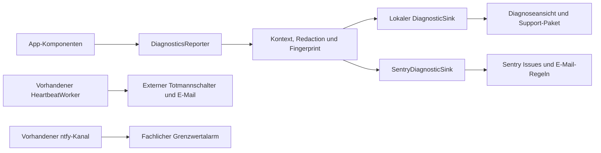

# Diagnose-, Fehleranalyse- und Observability-Konzept

**Stand:** August 2026

**Status:** Vollständig implementiert (`com.example.lrmprotokoll.diagnose.*`), getestet und integriert

**Zugehörige externe Checkliste:** [EXTERNE_DIENSTE_EINRICHTUNG.md](EXTERNE_DIENSTE_EINRICHTUNG.md)

## 1. Zielbild

Jeder relevante Fehler soll möglichst nah am Entstehungsort mit dem notwendigen technischen Kontext erfasst werden. Kritische neue Probleme sollen per E-Mail sichtbar werden. Gleichzeitig muss ein Nutzer bei einem Problem eine verständliche Diagnose-ID und eine kontrollierte Möglichkeit zum Teilen eines Support-Pakets erhalten.

Das System kombiniert drei unterschiedliche Signale:

1. **Fehlerdiagnose:** Sentry erfasst Abstürze, ANRs und ausgewählte behandelte Fehler (`SentryDiagnosticSink`).
2. **Lebenszeichen:** Der bereits vorhandene Heartbeat/Totmannschalter meldet das Ausbleiben einer laufenden Überwachung über einen externen Dienst.
3. **Fachliche Alarme:** Das bereits vorhandene ntfy-System meldet Grenzwertüberschreitungen.

Diese Signale dürfen nicht vermischt werden. Ein fachlicher Alarm ist kein Softwarefehler. Ein Heartbeat-Ausfall beweist nicht automatisch einen Absturz. Ein einzelner kurzzeitiger BLE-Reconnect soll keine E-Mail auslösen.

### 1.1 Realistische Vollständigkeit

„Jeden Fehler direkt erhalten“ ist ein Ziel, aber keine technisch absolute Garantie. Ein Ereignis kann nicht sofort übertragen werden, wenn das Gerät offline, ausgeschaltet, vom Betriebssystem hart beendet oder bereits vor der Initialisierung der Diagnosebibliothek abgestürzt ist. Das Konzept schließt diese Lücken so weit wie möglich:

- lokales Zwischenspeichern bis wieder Netzwerk verfügbar ist,
- Abruf von Informationen zum vorherigen Prozessende beim nächsten Start,
- Heartbeat als externes Signal für eine verstummte laufende Überwachung,
- Support-Paket als kontrollierter manueller Rückkanal (`SupportBundleExporter`).

## 2. Implementierungsstand auf `main`

Die folgenden Bausteine sind vollständig umgesetzt:

| Baustein | Aufgabe | Status |
|---|---|---|
| `DiagnosticsReporter` | Zentrales Interface für strukturierte Breadcrumbs, Fehlerberichte & Kontext | ✅ Implementiert (`CompositeDiagnosticsReporter`) |
| `SentryDiagnosticSink` | Anbindung an Sentry Remote Crash-Reporting | ✅ Implementiert (DSN konfigurierbar) |
| `DiagnosticLogger` / `DiagnosticLogDao` | Technisches lokales Diagnoseprotokoll in Room (V12) | ✅ Implementiert |
| `DiagnosticRedactor` | Bereinigung von sensiblen Daten (Tokens, MACs, Passwörtern) | ✅ Implementiert & getestet |
| `DiagnosticFingerprint` & `DiagnosticRateLimiter` | Stabile Fehlergruppierung & Sentry-Kontingentschutz | ✅ Implementiert & getestet |
| `SupportBundleExporter` | Kontrollierter ZIP-Export (Logs, System-Health, Metriken) | ✅ Implementiert & getestet |
| `SystemHealthChecker` | Health-Prüfung (Speicher, Akku-Optimierung, Berechtigungen) | ✅ Implementiert |
| `DiagnosticLogCleanupCoordinator` | Automatische 7-Tage-Bereinigung lokaler Diagnose-Logs | ✅ Implementiert |
| `DiagnoseScreen` | Live-Status, Reconnects, Volltextsuche im Diagnose-Log, Drive-Verlauf & Support-Export | ✅ Implementiert |

## 3. Architektur

Die App erhält eine kleine anbieterneutrale Diagnoseschicht. Fachcode darf nicht direkt an jeder Stelle Sentry aufrufen. Dadurch bleiben Tests einfach, Datenschutzregeln zentral und ein späterer Anbieterwechsel möglich.



### 3.1 Kernkomponenten

#### `DiagnosticsReporter`

Ein app-weites Interface mit wenigen wohldefinierten Operationen:

```kotlin
interface DiagnosticsReporter {
    fun breadcrumb(event: DiagnosticBreadcrumb)
    fun report(event: DiagnosticEvent, cause: Throwable? = null): DiagnosticId
    fun updateContext(context: DiagnosticContext)
}
```

Der Rückgabewert `DiagnosticId` ist eine zufällige Ereignis-ID. Sie kann in einer Fehlermeldung angezeigt und vom Support in Sentry oder einem exportierten Paket gesucht werden.

#### Sinks

- `LocalDiagnosticSink`: überführt geeignete Ereignisse in den vorhandenen `DiagnosticLogger` und Room-Speicher.
- `SentryDiagnosticSink`: überträgt freigegebene Ereignisse und Breadcrumbs an Sentry.
- `NoOpDiagnosticSink`: deterministischer Ersatz für Unit- und Instrumentation-Tests.
- `CompositeDiagnosticsReporter`: verteilt ein bereinigtes Ereignis an die aktiven Sinks.

#### Zentrale Verarbeitung

- `DiagnosticRedactor` entfernt Geheimnisse und unzulässige Inhalte.
- `DiagnosticFingerprint` sorgt für stabile Gruppierung gleicher Ursachen.
- `DiagnosticRateLimiter` bündelt Wiederholungen und schützt das Sentry-Kontingent.
- `DiagnosticContextProvider` erzeugt einen kleinen, konsistenten technischen Kontext.
- `SupportBundleExporter` erstellt auf Nutzerwunsch ein kontrolliertes Diagnosepaket.

## 4. Ereignisklassen und Schweregrade

### 4.1 Ereignisklassen

| Klasse | Bedeutung | Remote-Übertragung |
|---|---|---|
| Breadcrumb | Zustandswechsel vor einem Fehler | Nur als Kontext, kein eigenes Issue |
| Warning | Ungewöhnlicher, automatisch behobener Zustand | Lokal; remote nur bei Häufung |
| Handled Error | Fehler wurde abgefangen, Funktion ist eingeschränkt oder fehlgeschlagen | Ja, wenn relevant |
| Fatal | Unbehandelte Exception oder Prozessabbruch durch die App | Immer, sobald möglich |
| ANR | Hauptthread reagiert nicht | Immer |
| Health Signal | Heartbeat, Worker- oder Queue-Zustand | Lokal oder Breadcrumb; externer Heartbeat bleibt separat |
| User Report | Vom Nutzer aktiv gemeldetes Problem | Mit explizit gewähltem Support-Inhalt |

### 4.2 Schweregrade

| Grad | Verwendung |
|---|---|
| `DEBUG` | Nur Debug-Build und temporäre lokale Entwicklung |
| `INFO` | Relevanter Zustandswechsel, normalerweise Breadcrumb |
| `WARN` | Automatisch behobene Abweichung |
| `ERROR` | Funktion fehlgeschlagen oder Daten gefährdet |
| `FATAL` | Prozess oder Kernfunktion nicht mehr zuverlässig |

Erwartete Zustände wie Nutzerabbruch, fehlende noch nicht erteilte Berechtigung oder `CancellationException` sind keine technischen Fehler. Insbesondere muss `CancellationException` nach einem optionalen Breadcrumb erneut geworfen und darf nicht als Exception gemeldet werden.

## 5. Stabile Fehlercodes

Jedes relevante Ereignis erhält einen stabilen, englischen Code. Freitext ist nur Zusatzkontext und darf nicht zum Gruppierungsschlüssel werden.

| Bereich | Vorgesehene Codes |
|---|---|
| App/Prozess | `APP_UNCAUGHT`, `APP_PREVIOUS_EXIT`, `APP_STARTUP_FAILED` |
| Audio | `AUDIO_INIT_FAILED`, `AUDIO_READ_FAILED`, `AUDIO_FILE_WRITE_FAILED`, `AUDIO_FOREGROUND_SERVICE_FAILED` |
| KI | `AI_MODEL_INIT_FAILED`, `AI_INFERENCE_FAILED`, `AI_INVALID_OUTPUT` |
| Datenbank | `DB_OPEN_FAILED`, `DB_MIGRATION_FAILED`, `DB_WRITE_FAILED` |
| BLE | `BLE_SCAN_FAILED`, `BLE_CONNECT_FAILED`, `BLE_GATT_ERROR`, `BLE_GATT_TIMEOUT`, `BLE_STREAM_STALLED`, `BLE_DECODE_RATE_HIGH`, `BLE_CADENCE_INVALID` |
| Alarm | `ALERT_LOCAL_FAILED`, `ALERT_NTFY_FAILED`, `ALERT_STATE_PERSIST_FAILED` |
| Heartbeat | `HEARTBEAT_SEND_FAILED`, `HEARTBEAT_CONFIGURATION_INVALID` |
| Drive | `DRIVE_AUTH_REQUIRED`, `DRIVE_AUTH_FAILED`, `DRIVE_SYNC_FAILED`, `DRIVE_UPLOAD_FAILED` |
| Bericht/Export | `REPORT_CREATE_FAILED`, `EXPORT_FAILED`, `PLAYBACK_FAILED`, `SUPPORT_BUNDLE_FAILED` |
| Berechtigungen | `PERMISSION_REVOKED_DURING_OPERATION` |

Die Liste wird als `enum class DiagnosticCode` umgesetzt. Neue Codes benötigen eine kurze Dokumentation und mindestens einen Test der Gruppierung.

## 6. Ereignisschema

Ein Ereignis besteht aus einem kleinen Pflichtteil und optionalen, typisierten Domänen-Snapshots.

### 6.1 Pflichtfelder

| Feld | Beschreibung |
|---|---|
| `diagnosticId` | Zufällige UUID, keine Gerätekennung |
| `timestampUtc` | UTC-Zeitpunkt |
| `elapsedRealtimeMs` | Monotone Zeit für Reihenfolgen innerhalb einer Sitzung |
| `code` | Stabiler Fehlercode |
| `severity` | Schweregrad |
| `handled` | Ob die App die Exception abgefangen hat |
| `retryable` | Ob ein automatischer Wiederholungsversuch sinnvoll ist |
| `userVisible` | Ob der Nutzer bereits eine Fehlermeldung gesehen hat |
| `component` | Technische Komponente, beispielsweise `BleMeterTransport` |
| `operation` | Begrenzter Operationsname, kein Freitext aus Nutzerdaten |
| `causeClass` | Exception-Klasse ohne geheimen Inhalt |
| `fingerprint` | Stabiler Gruppierungsschlüssel |

### 6.2 Build- und Geräteinformationen

- App-Version und `versionCode`
- Build-Typ und Diagnose-Umgebung, beispielsweise `debug`, `internal`, `production`
- Git-Commit-SHA bzw. Release-Bezeichner
- Android-Version und API-Level
- Gerätemodell und Hersteller
- Locale und Zeitzone
- Netzwerktyp und grober Online-Status
- Akkustand und Ladezustand, wenn ohne zusätzliche Berechtigung verfügbar
- grobe freie Speicherklasse statt vollständiger Pfade
- grober Speicher-/Low-Memory-Status

Nicht verwendet werden Seriennummer, Advertising ID, Telefonnummer, Kontoname, präziser Standort oder andere dauerhafte Hardwarekennungen.

### 6.3 Sitzungs- und Bedienkontext

- zufällige App-Sitzungs-ID,
- zufällige Überwachungs-Sitzungs-ID,
- aktuelle Route bzw. Screen-Kennung,
- letzte technische Nutzeraktion als fest definierter Code,
- Status `monitoringActive`, `audioRecordingActive`, `alarmActive`,
- Anzahl ausstehender Hintergrundarbeiten.

### 6.4 Domänenspezifische Snapshots

#### Audio und KI

- Sample-Rate und Kanalmodus,
- aktueller Audio-/Service-Zustand,
- Modellversion,
- letzte erfolgreiche Inferenz vor wie vielen Millisekunden,
- Dauer der letzten Inferenz,
- keine Audioframes und keine WAV-Datei.

#### BLE

- Transportzustand,
- Gerätemodellkennung ohne MAC-Adresse,
- letzte erfolgreiche Frame-Zeit,
- Reconnect-Zähler,
- GATT-Statuscode,
- Queue-Operation,
- Decoder-Erfolgs-/Fehlerrate,
- grobe Messkadenz,
- keine vollständigen Rohframes im Remote-Ereignis.

#### Datenbank und Berichte

- Datenbankschema-Version,
- fehlgeschlagene Operation,
- grobe Anzahl betroffener Datensätze,
- keine Labels, Notizen, Dateinamen oder App-internen absoluten Pfade.

#### Drive und Netzwerk

- Worker-ID bzw. Run Attempt Count,
- HTTP-Status oder standardisierte Fehlerklasse,
- Upload-Typ und grobe Dateigrößenklasse,
- Authentifizierungsstatus,
- keine OAuth-Tokens, E-Mail-Adresse oder vollständige Serverantwort.

## 7. Breadcrumb-Konzept

Breadcrumbs erklären, was unmittelbar vor einem Fehler geschah. Sie sind bewusst begrenzt und verwenden feste Codes.

Beispiele:

- App gestartet und vorherigen Exit geprüft,
- Berechtigung angefragt, erteilt oder verweigert,
- Überwachung gestartet oder bewusst gestoppt,
- Foreground-Service gestartet,
- BLE-Scan, Verbindungsversuch, GATT-Discovery und Streamstart,
- Reconnect eingeplant,
- Alarmzustand ausgelöst, bestätigt oder beendet,
- Drive-Worker gestartet, verschoben, erfolgreich oder fehlgeschlagen,
- Heartbeat-Worker ausgeführt oder übersprungen,
- Diagnoseeinstellung geändert.

Nicht als Breadcrumb zulässig sind rohe Nutzertexte, komplette Stacktraces, vollständige Serverantworten, Roh-Audio, Bluetooth-Rohframes, Topics oder geheime URLs.

## 8. Datenschutz und Redaction

### 8.1 Unzulässige Daten

Folgende Daten dürfen weder an Sentry noch in ein automatisch exportiertes Paket gelangen:

- WAV- oder Mikrofoninhalt,
- vollständige Bluetooth-MAC-Adresse,
- ntfy-Topic,
- Heartbeat-Ping-URL,
- OAuth-Access-/Refresh-Token,
- Sentry-Authentifizierungstoken,
- vollständige lokale Dateipfade,
- Nutzerlabels, Notizen oder manuell vergebene Dateinamen,
- E-Mail-Adresse oder Google-Kontoname,
- unbereinigte HTTP-Header und Serverantworten.

### 8.2 Technische Maßnahmen

- Sentry `sendDefaultPii` bleibt deaktiviert.
- `beforeSend` führt die letzte zentrale Bereinigung vor jeder Übertragung aus.
- Schlüssel mit Mustern wie `token`, `secret`, `authorization`, `topic`, `heartbeat`, `url`, `path`, `account` werden blockiert oder typisiert bereinigt.
- URLs werden grundsätzlich auf Schema, Host-Klasse und Statuscode reduziert; Capability-URLs werden vollständig verworfen.
- Exception-Nachrichten aus Bibliotheken werden nicht blind als Tag übernommen.
- Tags haben eine feste Allowlist.
- Anhänge sind standardmäßig deaktiviert.
- Session Replay, Screenshots und View Hierarchy bleiben deaktiviert.

### 8.3 Einwilligung und lokale Aufbewahrung

Empfehlung für die erste produktive Version:

- Vor der ersten Remote-Übertragung wird einmal transparent um Zustimmung zu technischer Fehlerdiagnose gebeten.
- Ohne Zustimmung bleiben automatische Remote-Sinks deaktiviert; der lokale App-Betrieb funktioniert weiter.
- Die Zustimmung kann in den Einstellungen widerrufen werden.
- Der Nutzer kann ein Support-Paket unabhängig davon bewusst selbst teilen.
- Das vorhandene detaillierte lokale Diagnoseprotokoll bleibt standardmäßig ausgeschaltet und wird nur explizit aktiviert.
- Lokale Diagnoseeinträge werden weiterhin nach sieben Tagen bereinigt.
- Die externe Aufbewahrungszeit richtet sich nach der dokumentierten Sentry-Konfiguration.

Diese Empfehlung muss vor Implementierungsphase 2 mit der Datenschutzerklärung und dem geplanten Verteilungsmodell abgestimmt werden.

## 9. Gruppierung, Deduplizierung und Kontingentschutz

Ohne Begrenzung kann ein 10-Hz-Datenstrom bei einem Fehler sehr viele identische Meldungen erzeugen. Deshalb wird vor jedem Remote-Sink gruppiert.

### 9.1 Fingerprint

Der Fingerprint wird aus stabilen Feldern gebildet:

```text
code + component + operation + causeClass + normalisierter Statuscode
```

Zeitstempel, Diagnose-ID, Fehlermeldung, Reconnect-Zahl und Nutzerwerte gehören nicht in den Fingerprint.

### 9.2 Regeln

- Fatal Errors und ANRs werden immer von Sentry erfasst.
- Der erste neue behandelte Fehler eines Fingerprints wird sofort übertragen.
- Wiederholungen innerhalb eines kurzen Fensters erhöhen nur einen lokalen Zähler.
- Nach 15 Minuten kann eine gebündelte Zusammenfassung mit `occurrenceCount` übertragen werden.
- Pro Fingerprint und App-Sitzung gilt eine feste Obergrenze.
- Sehr häufige bekannte Warnungen werden nur als Breadcrumb geführt.
- Bei ausgeschöpftem Kontingent bleiben Fatal Errors, ANRs und neue Fingerprints priorisiert.
- Sentry-interne Abtastraten werden zusätzlich konfiguriert, ersetzen aber nicht die fachliche Begrenzung in der App.

Die konkreten Grenzwerte werden in Tests festgeschrieben und dürfen per BuildConfig abgesenkt werden können. Eine unbegrenzte Ereignisschleife ist ein Release-Blocker.

## 10. E-Mail- und Eskalationskonzept

| Signal | Kanal | Reaktionsziel |
|---|---|---|
| Neuer Fatal Error | Sentry-E-Mail | Sofort prüfen |
| Neuer ANR | Sentry-E-Mail | Sofort prüfen |
| Regression eines gelösten Fehlers | Sentry-E-Mail | Sofort prüfen |
| Kritischer behandelter Fehler, beispielsweise Datenbank oder Aufnahmeausfall | Sentry-E-Mail | Am selben Tag prüfen |
| Fehlerhäufung über Schwellenwert | Sentry-E-Mail | Trend und betroffene Version prüfen |
| Ausbleibender Heartbeat während Überwachung | Heartbeat-Dienst per E-Mail | Gerät/Prozess/Netz prüfen |
| Grenzwertalarm | ntfy und lokale Meldung | Fachlich reagieren |
| Einzelner BLE-Reconnect oder temporärer Uploadfehler | Keine Einzelmail | Nur bei Häufung bzw. endgültigem Scheitern |

E-Mail-Regeln werden im Sentry- und Heartbeat-Interface eingerichtet, nicht im Android-Code. Die manuellen Schritte stehen in [EXTERNE_DIENSTE_EINRICHTUNG.md](EXTERNE_DIENSTE_EINRICHTUNG.md).

## 11. Nutzeroberfläche und Austauschmöglichkeit

### 11.1 Diagnoseansicht erweitern

Die bestehende `DiagnoseScreen` erhält zusätzlich:

- Status der technischen Fehlerübertragung,
- Einwilligungsstatus und Umschalter,
- letzte erfolgreiche Übertragung,
- Anzahl lokal wartender Ereignisse,
- letzte Diagnose-ID,
- Schaltfläche **Problem melden**,
- Schaltfläche **Support-Paket exportieren**,
- Schaltfläche **Lokale Diagnosedaten löschen**,
- nur im Debug-Build: **Testmeldung senden** und **Testabsturz auslösen**.

### 11.2 Fehlerhinweise

Wenn eine Kernfunktion für den Nutzer fehlschlägt, enthält der Hinweis:

1. eine verständliche Auswirkung,
2. eine mögliche nächste Handlung,
3. eine kurze Diagnose-ID.

Beispiel:

```text
Die Messgerät-Verbindung konnte nicht wiederhergestellt werden.
Prüfe Bluetooth und den Abstand zum Gerät.
Diagnose-ID: 8F42-1A7C
```

Interne Exception-Texte und Stacktraces werden nicht in der normalen UI gezeigt.

### 11.3 Support-Paket

Das Paket wird nur nach einer bewussten Nutzeraktion erstellt und über Android Sharesheet geteilt. Es ist ein ZIP mit:

```text
support-bundle/
  README.txt
  summary.json
  events.jsonl
  breadcrumbs.jsonl
  device.json
  checksums.sha256
```

Standardinhalt:

- App-/Buildversion,
- bereinigte Geräte- und Laufzeitinformationen,
- letzte begrenzte Diagnoseereignisse,
- technische Breadcrumbs,
- aktueller Status der Hauptkomponenten,
- SHA-256-Prüfsummen der Paketdateien.

Standardmäßig nicht enthalten:

- WAV-Dateien,
- Messbericht-Inhalte,
- Nutzerlabels und Notizen,
- Tokens, Topics, URLs oder Kontodaten,
- vollständiger Logcat-Auszug.

Eine Audioaufnahme dürfte nur über einen getrennten, unmissverständlichen Auswahlschritt angehängt werden. Für die erste Implementierung wird diese Möglichkeit nicht gebaut.

## 12. Trigger-Matrix im Code

Die Trigger werden an Funktionsgrenzen gesetzt. Nicht jeder `catch`-Block erzeugt automatisch ein eigenes Remote-Issue.

| Komponente | Breadcrumbs | Remote-Fehlertrigger |
|---|---|---|
| `LaermprotokollApp` / `AppContainer` | App-Start, Konfigurationsstatus | Uncaught Exception, app-weite Coroutine-Exception, Fehler beim Start |
| Prozessstart | vorherige Prozessbeendigung gelesen | verdächtiger `ApplicationExitInfo`-Grund beim nächsten Start |
| `AudioRecordingService` | Start, Stop, Foreground-Status | Audioinitialisierung, Read-Loop, Dateischreiben, Servicefehler |
| `NoiseClassifier` | Modell geladen, Inferenzzeiten als Metrik | Modellinitialisierung, Inferenzexception, ungültige Ausgabe |
| `BleScanner` | Scanstart/-ende, Ergebnis vorhanden | Scanfehler, fehlende Berechtigung während Betrieb |
| `BleMeterTransport` / GATT | Connect, Discover, Stream, Disconnect | GATT-Status, Timeout, Stall, endgültiger Verbindungsabbruch |
| `GattQueue` | Operation gestartet/beendet | Timeout, Protokollverletzung, Queue-Stall |
| Decoder/Kadenz | Qualitätszähler | hohe Fehlerquote oder unplausible Kadenz nach Zeitfenster |
| `ConnectionSupervisor` | State-Wechsel und Backoff | Reconnect-Budget ausgeschöpft |
| `AlarmCoordinator` | ausgelöst, bestätigt, beendet | Zustand nicht persistierbar, Kanal endgültig fehlgeschlagen |
| `NtfyAlertChannel` | Versuch und Ergebnis | endgültiger Sendefehler nach Retry; keine geheime URL |
| `HeartbeatWorker` | ausgeführt, erfolgreich, übersprungen | lokale Warnung bei Sendefehler; externe E-Mail entsteht erst beim Ausbleiben |
| `DriveSyncWorker` | Start, Plan, Uploadschritt, Abschluss | Authentifizierung, endgültiger Upload- oder Dateifehler |
| Room/DAOs/Worker | Migration/Operation als fester Code | Öffnungs-, Migrations- und dauerhafter Schreibfehler |
| Bericht/Export/Player | Nutzeraktion und Abschluss | Export-, PDF-, Freigabe- oder Wiedergabefehler |
| UI-Routen | Screenwechsel und letzte Aktion als Code | nur behandelte Fehler an klaren Use-Case-Grenzen |

## 13. Umsetzung in sinnvollen Teilschritten

Jede Phase wird in einem eigenen Branch und Pull Request umgesetzt. Nach jeder Phase müssen mindestens `assembleDebug` und die Unit-Tests erfolgreich sein. Reale Gerätetests bleiben zusätzlich erforderlich.

### Phase 0 – Entscheidungen und externe Grundkonfiguration

**Ziel:** Keine technische Integration beginnen, bevor Identität, Empfänger und Datenschutz geklärt sind.

Aufgaben:

- endgültige Paket-ID entscheiden,
- Sentry-Projekt und E-Mail-Empfänger anlegen,
- Einwilligungsmodell festlegen,
- Heartbeat-Dienst mit E-Mail konfigurieren und vorhandene Implementierung testen,
- Google-OAuth-Werte bereitstellen,
- GitHub Default Branch auf `main` korrigieren,
- externe Checkliste vollständig ausfüllen.

Definition of Done:

- alle nicht geheimen Projektkennungen sind bekannt,
- Geheimnisse liegen ausschließlich in geeigneten Secret-Speichern,
- Datenschutzentscheidung ist dokumentiert,
- der vorhandene Totmannschalter wurde auf einem realen Gerät abgenommen.

### Phase 1 – Anbieterneutraler Diagnosekern

**Ziel:** Einheitliche Fehlercodes, Kontext, Redaction und Tests ohne externen Anbieter.

Vorgesehene Dateien:

```text
app/src/main/java/com/example/lrmprotokoll/diagnose/
  DiagnosticCode.kt
  DiagnosticEvent.kt
  DiagnosticContext.kt
  DiagnosticsReporter.kt
  CompositeDiagnosticsReporter.kt
  DiagnosticRedactor.kt
  DiagnosticFingerprint.kt
  DiagnosticRateLimiter.kt
```

Aufgaben:

- Ereignismodell und Fehlercodes implementieren,
- lokale und No-op-Sinks definieren,
- vorhandenen `DiagnosticLogger` als lokalen Sink anbinden,
- `AppContainer` um genau eine Reporter-Instanz erweitern,
- zentrale Allowlist und Redaction implementieren,
- Fingerprint und Rate Limits implementieren,
- Clock/UUID über Test-Schnittstellen injizierbar machen.

Tests:

- jeder sensible Schlüssel wird entfernt,
- URLs, Tokens, MAC-Adressen und Pfade werden bereinigt,
- gleiche Ursachen ergeben gleiche Fingerprints,
- dynamische Werte ändern den Fingerprint nicht,
- Wiederholungen werden gebündelt,
- Fatal Events werden nicht durch das normale Rate Limit verworfen.

Definition of Done:

- noch keine Sentry-Abhängigkeit im Fachcode,
- vorhandene Diagnoseansicht funktioniert weiter,
- alle neuen Kernklassen sind durch Unit-Tests abgedeckt.

### Phase 2 – Sentry-Grundintegration

**Ziel:** Fatal Errors, ANRs und explizit gemeldete Ereignisse datensparsam empfangen.

Aufgaben:

- offizielle Sentry-Android-Abhängigkeit und Gradle-Integration ergänzen,
- DSN und Umgebung über Build-Konfiguration einbinden,
- Sentry sehr früh in `LaermprotokollApp` initialisieren,
- Release aus App-Version plus Git-SHA bilden,
- `sendDefaultPii`, Replay, Screenshots und View Hierarchy deaktivieren,
- `beforeSend` mit `DiagnosticRedactor` verbinden,
- `SentryDiagnosticSink` implementieren,
- `AppContainer.appExceptionHandler` vom reinen `Log.e` auf den Reporter umstellen,
- Informationen zur vorherigen Prozessbeendigung über `ApplicationExitInfo` beim nächsten Start auswerten,
- R8/ProGuard-Mapping-Upload für minifizierte Release-Builds vorbereiten,
- Diagnoseübertragung per BuildConfig und Nutzereinwilligung abschaltbar machen.

Tests und Abnahme:

- Debug-Testmeldung,
- Testabsturz,
- Test-ANR auf realem Gerät,
- Offline-Ereignis und spätere Übertragung,
- Datenschutzinspektion im Sentry-Interface,
- genau eine E-Mail für ein neues Test-Issue.

Definition of Done:

- Sentry enthält Release, Environment, Fehlercode und bereinigten Kontext,
- kein Sentry-SDK-Aufruf ist über den Fachcode verteilt,
- App funktioniert vollständig bei deaktivierter Diagnoseübertragung.

### Phase 3 – Trigger an Funktionsgrenzen

**Ziel:** Fehler der Kernfunktionen werden konsistent und ohne Meldungssturm erfasst.

Reihenfolge:

1. Audioaufnahme und Foreground-Service,
2. KI-Modell und Inferenz,
3. Datenbank und Persistenz,
4. BLE Scan, GATT Queue, Decoder, Kadenz und Reconnect,
5. Alarmkanäle und Heartbeat,
6. Google Drive und Hintergrund-Worker,
7. Bericht, Export und Wiedergabe,
8. UI-Use-Cases.

Für jede Komponente:

- Zustandsübergänge als begrenzte Breadcrumbs ergänzen,
- relevante `catch`-Grenzen klassifizieren,
- `CancellationException` korrekt weiterwerfen,
- erwartete Zustände nicht als Exception melden,
- endgültiges Scheitern von einem noch laufenden Retry unterscheiden,
- einen automatisierten Test für Fehlercode und Context-Allowlist hinzufügen.

Definition of Done:

- jeder Code aus der Trigger-Matrix hat mindestens einen tatsächlichen Erzeugungspfad oder wird bis zur Nutzung aus dem Enum entfernt,
- bekannte Fehlerpfade erzeugen genau eine sinnvoll gruppierte Meldung,
- kein hochfrequenter Datenpfad erzeugt pro Frame ein Remote-Ereignis.

### Phase 4 – Support-Paket und lokale Diagnose

**Ziel:** Nutzer können ein Problem datensparsam und nachvollziehbar weitergeben.

Aufgaben:

- `SupportBundleExporter` implementieren,
- lokale Ereignisse und Breadcrumbs begrenzen,
- JSON-Schema versionieren,
- README und Prüfsummen in das ZIP schreiben,
- FileProvider/Android Sharesheet verwenden,
- Erzeugung und temporäre Dateien robust bereinigen,
- keine Aufnahme automatisch einschließen,
- statischen Secret-Scan über ein erzeugtes Testpaket laufen lassen.

Tests:

- Paket ist ohne Netzwerk erzeugbar,
- Paket ist deterministisch lesbar,
- Paket enthält keine verbotenen Daten,
- fehlerhafte oder volle Dateisysteme erzeugen einen verständlichen Fehler,
- geteilte URI besitzt nur temporäre Leseberechtigung.

Definition of Done:

- ein Paket kann aus einem Release-nahen Build über das Sharesheet geteilt werden,
- Diagnose-ID in UI, lokalem Ereignis und Remote-Ereignis stimmt überein.

### Phase 5 – Diagnose-Interface

**Ziel:** Übertragungsstatus und Support-Aktionen sind für Nutzer und Testteam sichtbar.

Aufgaben:

- bestehende `DiagnoseScreen` erweitern,
- Einwilligung und Widerruf integrieren,
- Status von lokalem Sink, Remote-Sink und Warteschlange anzeigen,
- Problem melden und Support-Paket exportieren,
- lokale Diagnosedaten löschen,
- Debug-only Testaktionen ergänzen,
- Fehlerhinweise der Kernfunktionen um kurze Diagnose-ID erweitern.

Definition of Done:

- Bedienung ist auf kleinen Displays, im Dark Mode und mit TalkBack verständlich,
- produktive Builds enthalten keinen sichtbaren Testabsturz-Schalter,
- Widerruf stoppt neue Remote-Übertragungen.

### Phase 6 – E-Mail-Regeln und End-to-End-Abnahme

**Ziel:** Ein reales Problem erreicht das Interface und die richtige E-Mail-Adresse.

Aufgaben:

- Sentry-Regeln aus der externen Checkliste aktivieren,
- Heartbeat-E-Mail separat testen,
- ntfy-Grenzwertalarm separat testen,
- vollständigen Weg `Trigger → lokaler Kontext → Sentry → E-Mail → Diagnose-ID` prüfen,
- Fehlalarm- und Wiederholungssturm simulieren,
- Runbook für die erste Untersuchung ergänzen.

Definition of Done:

- jeder Kanal liefert ausschließlich seine vorgesehene Meldungsart,
- bekannte Wiederholungen werden gebündelt,
- E-Mail führt direkt zu einem Issue mit ausreichend Kontext,
- Heartbeat-Ausfall ist vom App-Fehler unterscheidbar.

### Phase 7 – Hardening und Freigabe

**Ziel:** Robustheit unter realen Android- und Fehlerbedingungen nachweisen.

Testszenarien:

- Gerät offline und später wieder online,
- Prozess durch Android beendet,
- App durch Nutzer „Stopp erzwingen“ beendet,
- Doze und Akkuoptimierung,
- Netzwerkwechsel während Upload,
- Bluetooth während Stream deaktiviert,
- Messgerät außer Reichweite,
- Reconnect-Schleife und GATT-Fehlersturm,
- Mikrofonberechtigung während Betrieb entzogen,
- voller Speicher und nicht schreibbare Datei,
- beschädigte WAV-Datei,
- Datenbankfehler bzw. kontrollierter Migrationsfehler,
- widerrufene Google-Autorisierung,
- Fehler direkt beim App-Start,
- Release-Build mit R8 und Symbolauflösung,
- Secret- und Datenschutzprüfung aller Remote-Ereignisse und Support-Pakete.

Definition of Done:

- `assembleDebug`, `assembleRelease` und Unit-Tests erfolgreich,
- reale Gerätetest-Checkliste ergänzt und durchgeführt,
- keine Geheimnisse im Build, Logcat, Sentry oder Support-Paket,
- Betrieb kann über einen sicheren Kill Switch ohne App-Ausfall deaktiviert werden,
- Verantwortlicher hat E-Mail-, Sentry- und Heartbeat-Interface abgenommen.

## 14. Vorgesehene Dateiänderungen

| Bereich | Erwartete Änderung |
|---|---|
| `app/build.gradle.kts` | Sentry-Abhängigkeit, BuildConfig-Felder, Release-Metadaten |
| Root-Gradle-Konfiguration | gegebenenfalls Sentry-Plugin und CI-Konfiguration |
| `LaermprotokollApp.kt` | sehr frühe, datensparsame Initialisierung |
| `AppContainer.kt` | zentrale Reporter-Instanz und Coroutine-Handler |
| `diagnose/` | Ereignismodell, Reporter, Redaction, Rate Limit, Sinks, Support-Paket |
| `DiagnoseScreen.kt` | Übertragungsstatus, Einwilligung und Support-Aktionen |
| Audio-/KI-Komponenten | Funktionsgrenzen und Breadcrumbs |
| BLE-Komponenten | Zustands-, GATT-, Decoder- und Reconnect-Trigger |
| Alarm/Heartbeat | endgültige Sendefehler und Health-Breadcrumbs |
| Drive/Worker | Retry-aware Fehlercodes und Authstatus |
| Room/Bericht/Export | persistente und nutzersichtbare Fehlergrenzen |
| `.gitignore` | lokale Sentry-/Firebase-/Build-Geheimnisse ausschließen |
| Tests | Redaction, Gruppierung, Rate Limit und Fehlerpfade |
| Dokumentation | Runbook, Datenschutzhinweise und Gerätetestfälle |

## 15. Verifikationsmatrix

| Fehlerfall | Lokal sichtbar | Sentry-Issue | E-Mail | Heartbeat-E-Mail | Support-Paket |
|---|---:|---:|---:|---:|---:|
| Unbehandelter Absturz | Nach Neustart | Ja | Ja | Eventuell später, falls Überwachung lief | Ja |
| ANR | Nach Möglichkeit | Ja | Ja | Eventuell später | Ja |
| Audioinitialisierung endgültig fehlgeschlagen | Ja | Ja | Bei neu/kritisch | Nein | Ja |
| Einzelner BLE-Reconnect | Als Breadcrumb | Nein | Nein | Nein | Ja |
| Reconnect-Budget ausgeschöpft | Ja | Ja | Bei neu/kritisch | Möglicherweise später | Ja |
| Temporärer Drive-Retry | Als Breadcrumb | Nein | Nein | Nein | Ja |
| Drive-Upload endgültig fehlgeschlagen | Ja | Ja | Bei neu/kritisch | Nein | Ja |
| ntfy-Alarmversand endgültig fehlgeschlagen | Ja | Ja | Bei neu/kritisch | Nein | Ja |
| App verstummt während Überwachung | Eventuell nicht | Eventuell nicht | Eventuell nicht | Ja | Nach Neustart |
| Fachlicher Grenzwert überschritten | Alarmstatus | Nur bei Kanalfehler | Nein | Nein | Ja |

## 16. Rollout- und Rückfallstrategie

- Die gesamte Remote-Diagnose besitzt einen BuildConfig-Schalter.
- Zusätzlich steuert die Nutzereinwilligung den Remote-Sink.
- Der lokale No-op- bzw. Local-only-Betrieb bleibt jederzeit möglich.
- Sentry darf niemals Voraussetzung für App-Start, Aufnahme, BLE, Alarm oder Export sein.
- Exceptions im Diagnosepfad werden intern abgefangen und führen höchstens zu einem lokalen, begrenzten Logeintrag.
- Einführung zuerst in Debug/Internal, danach auf einem kleinen Testgerätebestand, zuletzt in Production.
- In jeder Stufe werden Ereignisvolumen, Gruppierung und Datenschutz geprüft.

## 17. Bewusst nicht Teil der ersten Implementierung

- eigener Diagnose-Backend-Server,
- parallele Vollintegration von Sentry und Firebase Crashlytics,
- Session Replay,
- automatische Screenshots,
- automatischer Upload von Audio oder vollständigem Logcat,
- dauerhafte Nutzer- oder Hardware-IDs,
- neuer zweiter Totmannschalter in Sentry,
- Firebase Cloud Messaging als Ersatz für ntfy,
- Remote-Ausführung von Diagnosebefehlen auf Nutzergeräten.

Eine spätere Firebase- oder andere Anbieterintegration muss ausschließlich einen neuen `DiagnosticSink` implementieren. Fachkomponenten und Ereignisschema bleiben unverändert.

## 18. Abnahmekriterien für das Gesamtkonzept

Das Vorhaben ist abgeschlossen, wenn:

- Abstürze, ANRs und definierte behandelte Fehler zuverlässig mit Release- und Domänenkontext ankommen,
- die E-Mail-Regeln neue kritische Probleme melden, ohne Wiederholungsspam zu erzeugen,
- der bestehende Heartbeat einen verstummten Überwachungslauf separat meldet,
- die Diagnoseansicht Status und letzte Diagnose-ID verständlich zeigt,
- Nutzer ein bereinigtes Support-Paket kontrolliert teilen können,
- Offline- und Neustartfälle getestet sind,
- kein Ereignis Geheimnisse, Audio oder personenbezogene Freitexte enthält,
- die App bei Ausfall oder Abschaltung aller Diagnosedienste uneingeschränkt weiterarbeitet,
- Dokumentation, Datenschutzangaben und reale Gerätetests aktualisiert und abgenommen sind.

## 19. Quellen und technische Referenzen

- [Sentry Android SDK](https://docs.sentry.io/platforms/android/)
- [Sentry Preise und Tarifgrenzen](https://sentry.io/pricing/)
- [Android ApplicationExitInfo](https://developer.android.com/reference/android/app/ApplicationExitInfo)
- [Android ANRs diagnostizieren](https://developer.android.com/topic/performance/anrs/diagnose-and-fix-anrs)
- [Android: Risiken durch sensible Logdaten](https://developer.android.com/privacy-and-security/risks/log-info-disclosure)
- [Firebase Crashlytics für Android](https://firebase.google.com/docs/crashlytics/android/get-started)
- [Crashlytics-Berichte anpassen](https://firebase.google.com/docs/crashlytics/android/customize-crash-reports)
- [healthchecks.io Dokumentation](https://healthchecks.io/docs/)
- [ntfy Dokumentation](https://docs.ntfy.sh/publish/)
